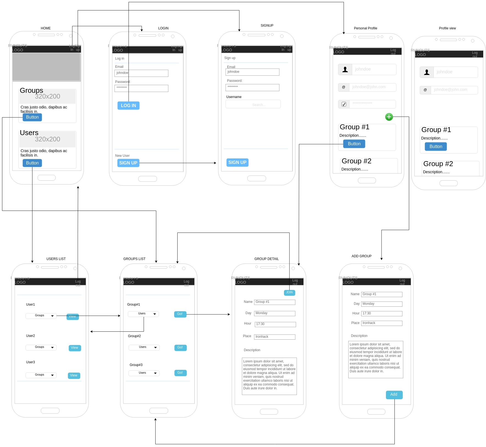

# Project Name: Runouts

## Description

Web mobile social application to stay in touch with other runners, find and create running groups and join them.
 
 ## User Stories

 - **404** - As a user I want to see a nice 404 page when I go to a page that doesn’t exist so that I know it was my fault.
 - **500** - As a user I want to see a nice error page when the super team screws it up so that I know that is not my fault.
 - **homepage** - As a user I want to be able to access the homepage so that I see what the app is about and login, signup or logout.
 - **sign up** - As a user I want to sign up on the webpage so that I can see all the groups. 
 - **login** - As a user I want to be able to log in on the webpage so that I can get back to my account.
 - **logout** - As a user I want to be able to log out from the webpage so that I can make sure no one will access my account.
 - **group create** - As a user I want to create a running group so that I can invite others to join.
 - **group list** - As a user I want to see all the groups available so that I can choose which ones I want to join.
 - **group detail** - As a user I want to see more information regarding one group so that I can decide if I want to join. 
 - **user list** - As a user I want to be able to see all the users so I can see their information and groups.
 - **user profile** - As a user I want to be able to see all my information and my groups.

## Backlog

User profile:
- see my profile
- upload my profile picture
- list groups the user is joined
- edit my profile information
- delete my user

Group profile: 
- add geolocation to groups when creating
- show group in a map in group detail page
- add schedule with routes by level
- edit my group information
- list users of the group
- delete my group

List places: 
- add list of places
- see groups in that places

Homepage: 
- Add search card

Search page: 
- filter options
- see results
- link group/user/place result

Email control:
- send email to new users
- send email when join a group


## ROUTES:
```
Homepage: 
    GET / 

Login:
    GET /auth/login
    POST /auth/login - POST Body: username, password

Signup:
    GET /auth/signup
    POST auth/signup - POST Body: username, password    

Logout:
    POST auth/logout - POST Body: nothing

List groups:
    GET /groups

Detail groups: 
    GET /groups/:id
    
Join a group:
    POST /groups/:id/join

Profile: 
    GET /profile/:id

Add group: 
    GET /groups/add
    POST /groups

List users: 
    GET /users

```

## MODELS

```
Group
 - name: String
 - description: String
 - day: Number
 - hour: String
 - place: String
 - owner: User
 - members: [Users]
 - active: Boolean (default: true)
```    
 
```
User
 - username: String 
 - password: String (required)
 - email: String (unique, required)
 - groups: [Groups]  ?????
```
## Mockup



## Links

### Trello

[Link to trello](https://trello.com/b/SXwUZaO5)

### Git

[Runouts](https://github.com/Arkhanne/runouts)

[Deploy Link](http://heroku.com)

### Slides.com

[Slides Link](http://slides.com)

